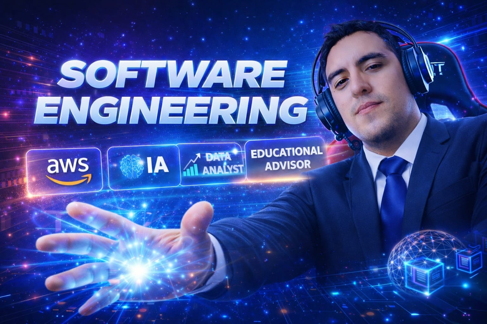

  

<h1 align="center">
  
</h1>

  <b>🚀 Transformando ideas en soluciones tecnológicas de alto impacto</b>

  
  

---

## 👨‍💻 Sobre Mí

### 🚀 Software Engineer | Full Stack Developer | Cloud Solutions Architect

Soy **Ingeniero de Sistemas e Informática** con **más de 5 años de experiencia** especializado en el diseño, desarrollo y despliegue de **aplicaciones web empresariales de nivel enterprise**. 

Mi enfoque combina **ingeniería de software avanzada** con tecnologías modernas en **Cloud Computing (AWS y Azure)**, **Business Intelligence (Power BI, QuickSight)** y aplicación práctica de **Inteligencia Artificial** para crear soluciones escalables y seguras que optimizan procesos de negocio.

#### 🎯 Áreas de Especialización:

- 💼 **Desarrollo de Software Empresarial** - Aplicaciones web end-to-end para sectores críticos
- ☁️ **Arquitectura Cloud** - Infraestructura escalable y serverless en AWS y Azure  
- 📊 **Business Intelligence & Data Analytics** - Transformación de datos en insights accionables
- 🔗 **Integración de APIs Gubernamentales** - RENIEC, SUNAT y sistemas públicos
- 🤖 **Soluciones con IA** - Automatización inteligente y optimización de procesos

#### 🏭 Sectores de Impacto:
`Salud` • `Educación` • `Gobierno` • `Transporte` • `Finanzas`

#### 💡 Actualmente:
- 🏢 Software Engineer en **2Cloud – Tecnología y Consultoría**
- 🎓 Instructor de tecnologías: Python, Power BI, SQL Server
- 🌱 Explorando arquitecturas serverless y avanzadas integraciones con IA

---

## 🛠️ Stack Tecnológico

<table align="center">
<tr>
<td align="center" width="25%">

### 💻 Frontend

</td>
<td align="center" width="25%">

### ⚙️ Backend

</td>
<td align="center" width="25%">

### 🗄️ Bases de Datos

</td>
<td align="center" width="25%">

### ☁️ Cloud & DevOps

</td>
</tr>
</table>

### 📊 Data & BI

### 🤖 AI & Automatización

---

## 🎯 Servicios Profesionales

<table>
<tr>
<td width="33%" align="center">

### 💻 Desarrollo de Software
Soluciones end-to-end alineadas a procesos empresariales reales

</td>
<td width="33%" align="center">

### ☁️ Cloud Computing
Arquitectura escalable en AWS y Azure con DevOps

</td>
<td width="33%" align="center">

### 📊 Business Intelligence
Dashboards interactivos y análisis de datos accionables

</td>
</tr>
<tr>
<td width="33%" align="center">

### 🌐 Aplicaciones Web
Plataformas seguras para sectores críticos

</td>
<td width="33%" align="center">

### 🤖 Soluciones con IA
Automatización y optimización de procesos

</td>
<td width="33%" align="center">

### 🎓 Capacitación Tech
Mentoría basada en experiencia real

</td>
</tr>
</table>

---

## 📫 Conectemos

---

### 💭 Filosofía de Trabajo

> *"La tecnología bien aplicada transforma procesos y genera impacto real"*

**¿Tienes un proyecto en mente?** 🚀  
Trabajemos juntos para convertir tu idea en una solución tecnológica de alto impacto

---

