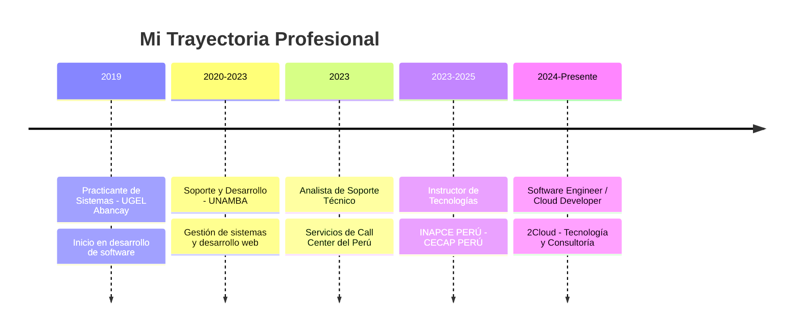

<div align="center">
  
</div>

<h1 align="center">
  
</h1>

<p align="center">
  <b>🚀 Transformando ideas en soluciones tecnológicas de alto impacto</b>
</p>

<p align="center">
  
  
</p>

---

## 👨‍💻 Sobre Mí

```javascript
const jersson = {
    ubicacion: "Abancay, Perú 🇵🇪",
    rol: "Software Engineer | Full Stack Developer",
    educacion: "Ingeniero de Sistemas e Informática",
    experiencia: "5+ años",
    
    especialidades: [
        "Desarrollo de Software Empresarial",
        "Arquitectura Cloud (AWS & Azure)",
        "Business Intelligence & Data Analytics",
        "Integración de APIs Gubernamentales",
        "Soluciones con Inteligencia Artificial"
    ],
    
    sectores: ["Salud", "Educación", "Gobierno", "Transporte", "Finanzas"],
    
    actualmente: {
        trabajando: "2Cloud – Tecnología y Consultoría",
        enfoque: "Soluciones Cloud y BI de nivel enterprise",
        aprendiendo: "Arquitecturas Serverless & AI Integration"
    },
    
    pasion: "Crear software que resuelva problemas reales y genere impacto medible"
};
```

---

## 🛠️ Stack Tecnológico

<table align="center">
<tr>
<td align="center" width="25%">

### 💻 Frontend


</td>
<td align="center" width="25%">

### ⚙️ Backend


</td>
<td align="center" width="25%">

### 🗄️ Bases de Datos


</td>
<td align="center" width="25%">

### ☁️ Cloud & DevOps


</td>
</tr>
</table>

<div align="center">

### 📊 Data & BI


### 🤖 AI & Automatización


</div>

---

## 🏆 Proyectos Destacados

<details open>
<summary><b>💼 Soluciones Empresariales</b></summary>

### 🏥 Sistema de Gestión de Historias Clínicas Odontológicas
> Plataforma completa para clínicas dentales con registro, control y seguimiento de pacientes


**✨ Features:** Control de citas • Historiales médicos • Gestión de tratamientos • Reportes estadísticos

---

### 🗂️ Sistema Web de Trámite Documentario
> Plataforma de gestión documental con integración RENIEC para validación de identidad


**✨ Features:** Seguimiento en tiempo real • Validación biométrica • Trazabilidad completa

---

### 🧾 Sistema de Facturación Electrónica para Transporte
> Solución integral para emisión de comprobantes electrónicos conforme a normativa SUNAT


**✨ Features:** Facturación electrónica • Integración SUNAT • Validación RENIEC • Reportes financieros

</details>

<details>
<summary><b>🎓 Soluciones Educativas (EdTech)</b></summary>

### 🏫 Sistema Web de Gestión Educativa
> Plataforma integral para administración académica de instituciones educativas


**✨ Features:** Gestión de estudiantes • Control de notas • Administración de docentes • Portal de padres

---

### 📜 Sistema de Emisión de Diplomas - UTEA
> Plataforma para emisión, validación y control de diplomas académicos


**✨ Features:** Generación automática de diplomas • Sistema de validación • Control de duplicados

</details>

<details>
<summary><b>🏛️ Soluciones Gubernamentales (GovTech)</b></summary>

### 🏠 Sistema de Saneamiento de Títulos de Propiedad
> Gestión y control de procesos de saneamiento físico-legal de propiedades


**✨ Features:** Mapeo georreferenciado • Trazabilidad documental • Gestión de expedientes

</details>

<div align="center">

**📌 Todos los proyectos desarrollados con:**  
✅ Código limpio y documentado  
✅ Arquitectura escalable  
✅ Seguridad implementada  
✅ Mejores prácticas de la industria

</div>

---

## 💼 Experiencia Profesional



<table>
<tr>
<td width="50%" valign="top">

### 🚀 Actual
**Software Engineer / Cloud Developer**  
*2Cloud – Tecnología y Consultoría*  
*Marzo 2024 - Presente*

- ☁️ Infraestructura en AWS y Azure
- 📊 Análisis de datos con QuickSight y Power BI
- 🤖 Desarrollo de soluciones con IA
- 💻 Software a medida para empresas internacionales

</td>
<td width="50%" valign="top">

### 🧑‍🏫 Docencia
**Instructor de Tecnologías**  
*INAPCE PERÚ - CECAP PERÚ*  
*Diciembre 2023 - Junio 2025*

- 🐍 Python & SQL Server
- 📊 Power BI
- 💼 Capacitación empresarial
- 🎯 Enfoque práctico y resultados medibles

</td>
</tr>
</table>

---

## 🎓 Certificaciones & Formación

<div align="center">

| Certificación | Institución | Año |
|:------------:|:-----------:|:---:|
| 🏆 Excelencia en Desarrollo de Software | INCOCAT S.R.L. | 2026 |
| ☁️ AWS Cloud Practitioner Essentials | AWS Training | 2025 |
| 💻 Especialización en Desarrollo de Software | Universidad Continental | 2025 |
| 🤖 Herramientas de Inteligencia Artificial | Capacitación Profesional | 2024 |
| 📊 Power BI - Actualización Profesional | Capacitación Profesional | 2022 |

</div>

---


## 🎯 Servicios Profesionales

<table>
<tr>
<td width="33%" align="center">

### 💻 Desarrollo de Software
Soluciones end-to-end alineadas a procesos empresariales reales

</td>
<td width="33%" align="center">

### ☁️ Cloud Computing
Arquitectura escalable en AWS y Azure con DevOps

</td>
<td width="33%" align="center">

### 📊 Business Intelligence
Dashboards interactivos y análisis de datos accionables

</td>
</tr>
<tr>
<td width="33%" align="center">

### 🌐 Aplicaciones Web
Plataformas seguras para sectores críticos

</td>
<td width="33%" align="center">

### 🤖 Soluciones con IA
Automatización y optimización de procesos

</td>
<td width="33%" align="center">

### 🎓 Capacitación Tech
Mentoría basada en experiencia real

</td>
</tr>
</table>

---

## 📫 Conectemos

<div align="center">

[](mailto:jersson1407miranda@gmail.com)
[](https://www.linkedin.com/)
[](https://github.com/jersson14)
[](https://tu-portfolio.com)

</div>

---

<div align="center">

### 💭 Filosofía de Trabajo

> *"La tecnología bien aplicada transforma procesos y genera impacto real"*

**¿Tienes un proyecto en mente?** 🚀  
Trabajemos juntos para convertir tu idea en una solución tecnológica de alto impacto

---


</div>